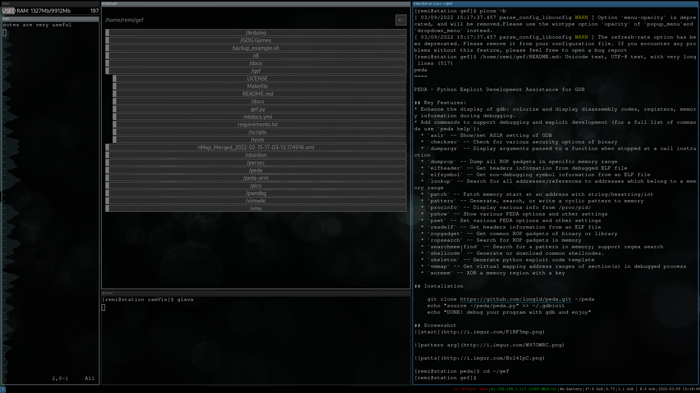

# HacknetGTK is a project that brings some of the Hacknet GUI elements to linux-based systems using GTK

### Projects that are already implemeneted or planned:
    * traceAnim - the famous trace animation
    * ramVis - ram usage visualization app
    * multiX - the DISPLAY from the original game. File manager, text and image viewer, and a network protocol to bind the GUI to a terminal shell

### Build dependencies

Python dependencies are in `requirements.txt` (install with `pip3 install -r requirements.txt`).

Install dependencies on:
**Arch**:
`sudo pacman -S binutils gcc make cairo gtk2 gtk3`
**Debian**:
`sudo apt install binutils gcc make libcairo2 libcairo2-dev gtk+2.0 gtk+3.0`

### Aesthetics notice

The whole project was developed under GNOME 3. If you intend to use the components with a tiling wm, things may look bad due to the way tiling managers allocate screen space.
Also, the text elements are entirely configured by your global gtk theme.

I advise to resize windows manually or using wm-specific rules, configure some colors for consistency, and install a dark gtk theme (i recommend adwaita-dark).
