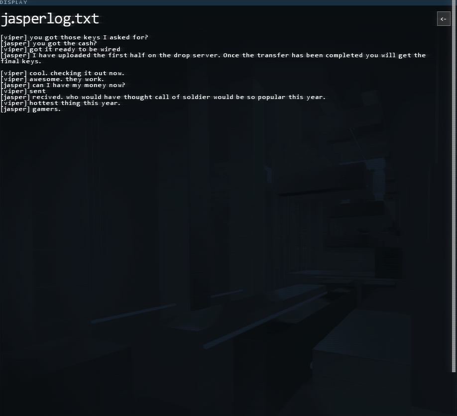

# MultiX - hacknet file manager remake

This is a remake of "DISPLAY" and "TERMINAL" windows from Hacknet. There are three parts to this project.
Different components have more detailed descriptions in their own directories.
Run the whole thing with `./run.sh`.

## Part 1: The GUI

The GUI is in `./display`. It is an interface, that mimics the original Hacknet DISPLAY window.
GUI is written entirely in python and needs `python-magic`.
Some configuration value are available in `./display/multixConfig.py`. (you will at least want to change `TOPLEVEL_PATH`value).

You can run it separately with `./display/daemon.py`.

## Part 2: The shell augmentation library

To bind the GUI to a terminal shell process, a shared library is implemented.
It is injected into the shell process with LD_PRELOAD.

The library should work with most linux shells (tested on bash, zsh, and dash).

Build it with `make lib`, run it with `make run`. You can configure the shell (bash by default) in the `./augmentation/Makefile`.

## Part 3: The communication protocol

The protocol that binds the augmented shell to GUI process. It uses unix sockets (`/tmp/multix.socket` by default).

# Screenshots

## Original 

## Project HacknetGTK

# Final notice

This component of HacknetGTK is not completely finished. It needs improvements.
**A list of potential improvements and limitations**:

    * Make images in GUI scale, instead of opening in full size
    * Maybe, include functionality to open audio and video players in a subwindow
    * Files, opened in GUI will open in the terminal, but not the other way around
