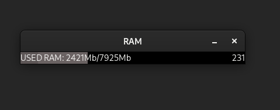

# Ram visualization window

This is a remake of "RAM" from Hacknet. There are some configuration values available in the source file.
Build it with `make build`.

The window will show a progressbar of occupied and active system memory. If text is enabled, two labels will be rendered: one indicating ram usage, the other indicating the number of active processes.

**"active" and "occupied" memory:**

Occupied refers to memory that's reserved in any way by the OS. It includes cached memory too.

Active memory is a subset of occupied memory. It is the memory that is actively used by some application.

## Screenshots

### Original

### Project HacknetGTK

